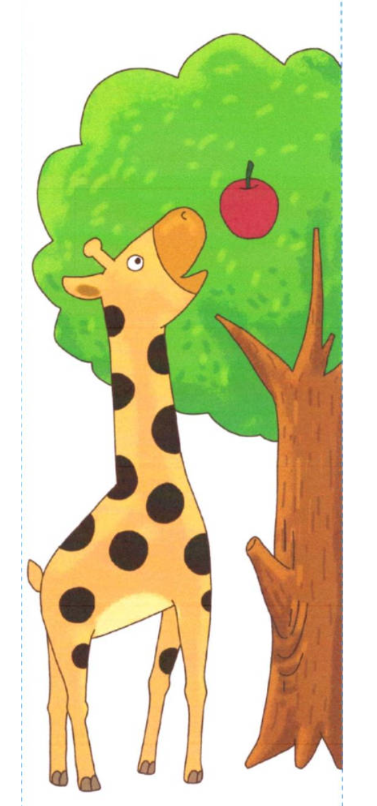
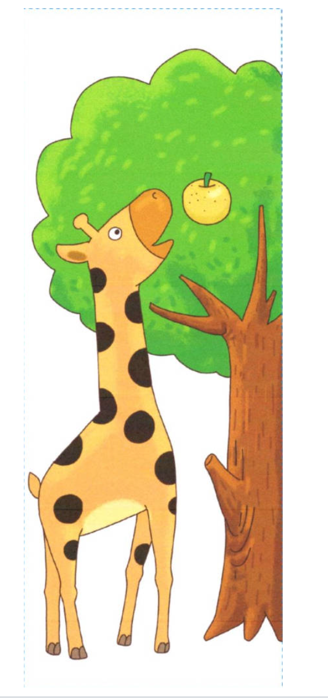
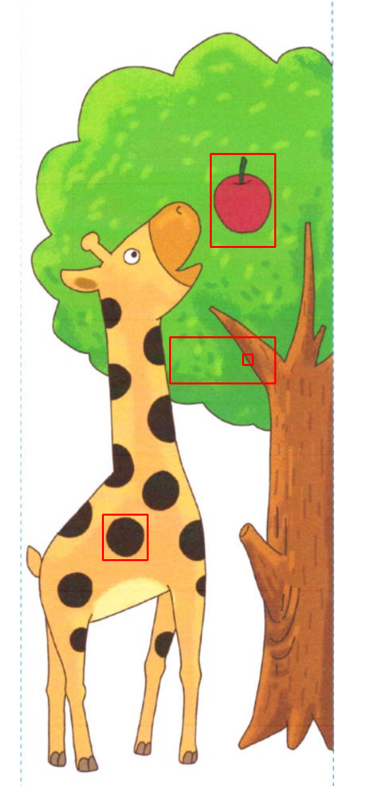
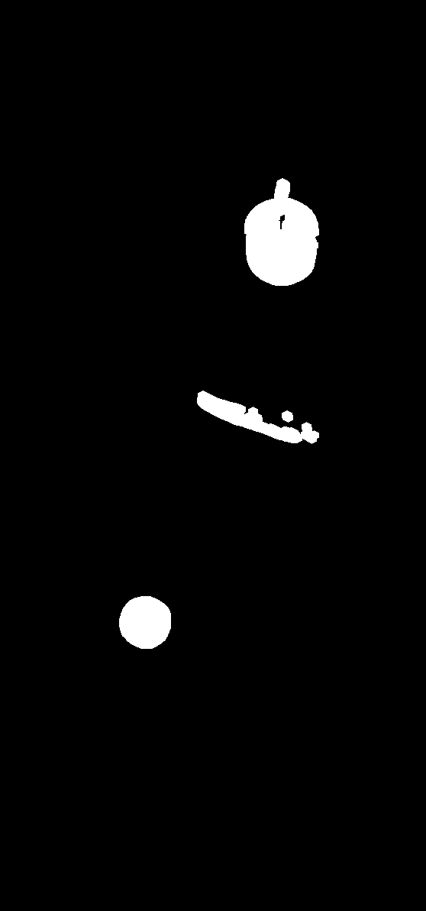

# 图片内容差异检测工具

[](https://www.python.org/downloads/)
[](https://opencv.org/)
[](README.md)

**基于 Python + OpenCV 的图片差异检测工具，支持自动对齐、差异定位、可视化标记。**

对比两张图片，找出内容差异区域，生成可视化结果。适用于 UI 截图对比、找茬游戏、图片版本追踪等场景。

**[English Documentation](README.md)** | **中文文档**

---

## 特性

- 🔍 **自动图片对齐** - ORB 特征匹配 + 单应性变换，支持不同尺寸、轻微位移/缩放的图片
- 🎯 **精准差异检测** - 像素级对比 + 形态学处理，准确定位内容差异
- 🖼️ **可视化标记** - 在原图上用红框标出差异区域，同时生成差异 mask 图
- 🔧 **噪点过滤** - 可配置阈值和最小区域面积，忽略无关噪点
- 💻 **命令行 & 模块** - 支持命令行直接运行，也可作为 Python 模块导入

## 安装

```bash
git clone https://github.com/Jandaes/image-diff-detector.git
cd image-diff-detector
pip install -r requirements.txt
```

依赖：`opencv-python >= 4.5.0`、`numpy >= 1.20.0`

## 快速开始

```bash
python diff_detector.py image1.png image2.png
```

输出文件：
- `diff_mask.png` - 差异区域二值图（白色为差异）
- `diff_marked.png` - 带红框标记的差异图

## 示例演示

### 输入图片

| 图片 A | 图片 B |
|:------:|:------:|
|  |  |

两张图片尺寸不同（504×852 vs 508×798），且有内容差异。

### 检测结果

```bash
python diff_detector.py a.png b.png
```

**差异标记图：**



**差异 Mask：**



---

## 使用方法

### 命令行参数

```bash
python diff_detector.py <图片1> <图片2> [选项]
```

| 参数 | 默认值 | 说明 |
|------|--------|------|
| `--threshold`, `-t` | 25 | 差异阈值 (0-255)，值越小越敏感 |
| `--min-area`, `-a` | 100 | 最小差异区域面积（像素），过滤噪点 |
| `--kernel-size`, `-k` | 5 | 形态学操作核大小 |
| `--output`, `-o` | 图片同目录 | 输出目录 |
| `--prefix`, `-p` | diff | 输出文件名前缀 |
| `--match-threshold` | 0.75 | 特征匹配质量阈值 |

### 参数调优

**检测细微差异：**
```bash
python diff_detector.py img1.png img2.png --threshold 15 --min-area 50
```

**忽略小噪点：**
```bash
python diff_detector.py img1.png img2.png --threshold 40 --min-area 500
```

**图片有较大位移：**
```bash
python diff_detector.py img1.png img2.png --match-threshold 0.6
```

### Python 模块调用

```python
from diff_detector import ImageDiffDetector

# 创建检测器
detector = ImageDiffDetector(threshold=25, min_area=100)

# 执行检测
result = detector.detect("image1.png", "image2.png")

# 获取差异区域
for region in result["regions"]:
    print(f"位置: ({region['x']}, {region['y']})")
    print(f"尺寸: {region['width']}x{region['height']}")
    print(f"面积: {region['area']} 像素")

# 输出文件路径
print(f"Mask: {result['mask_path']}")
print(f"标记图: {result['marked_path']}")
```

---

## 算法流程

```
图片 A ──┐
         ├──► 特征检测 (ORB) ──► 特征匹配 ──► 图片对齐 (单应性变换)
图片 B ──┘
                                                │
                                                ▼
                                    灰度转换 + 绝对差分 (AbsDiff)
                                                │
                                                ▼
                                    阈值处理 + 形态学操作
                                                │
                                                ▼
                                    轮廓检测 + 面积过滤
                                                │
                                                ▼
                                    可视化标记 (绘制矩形框)
```

## 适用场景

- 📱 UI 截图版本对比
- 🎮 找茬游戏图片分析
- 📄 文档/海报修改检测
- 🖌️ 设计稿版本追踪

---

## 局限性

- 不支持大角度旋转（>15°）
- 不支持严重遮挡或内容完全不同的图片
- 极端光照变化可能影响检测
- 不提供差异内容的语义描述

## 项目结构

```
image-diff-detector/
├── diff_detector.py      # 主程序
├── requirements.txt      # 依赖列表
├── README.md             # 英文文档
├── README_CN.md          # 中文文档
├── .gitignore            # Git 忽略配置
├── a.png                 # 示例图片 A
├── b.png                 # 示例图片 B
├── diff_mask.png         # 输出：差异 mask
└── diff_marked.png       # 输出：标记图
```

## License

MIT License

## Star History

[](https://www.star-history.com/?repos=Jandaes%2Fimage-diff-detector&type=date&legend=top-left)